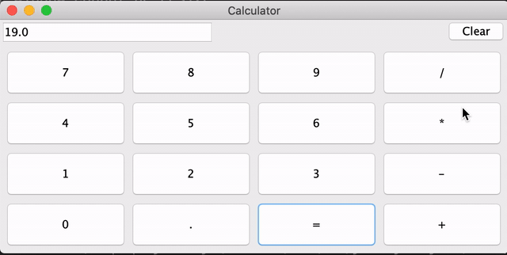
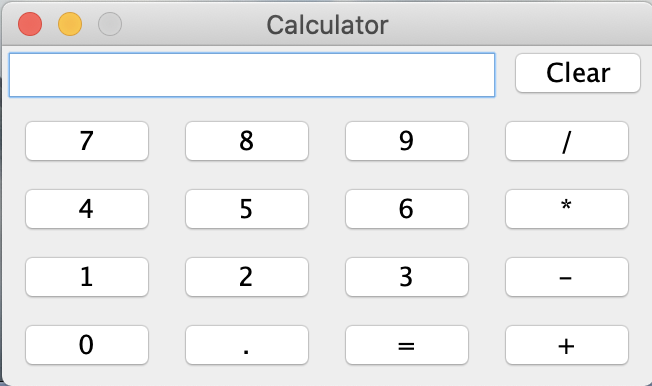

# Java Caculator
###
Demo

### Intro
A calculator can be implemented from these 3 parts:
A simple graphical interface needs to be composed of 
interface components, component event listeners 
(the logic that responds to various events), 
and specific event processing logic.

### Code Structure
In file calculator,java, we implemented such things:
1. Member variables: record calculation state
2. Member variables: record calculation results
3. Member variables: UI component objects
4. Calculator constructor
    - Add UI components to container JPanel
    - Add a click event listener for each button to complete the response logic
5. Main method: Create and Initialize Calculator object.

To create a window, we need JFrame class. In this project, we create a 
JFrame instance, and create this instance to add components.

### Panel
This calculator has 2 JPanel. JPanel is a light-weight container, a basket that
can hold other UI components.

JPanel is in javax.swing packet. It is a panel container and can be
added to JFrame. 

In this project, JPanel1 holds all buttons except clear button. JPanel2 holds clear button
and the output column.

Our main panel looks like this:

